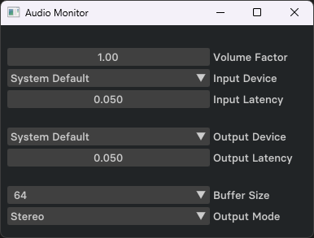

# Audio Monitor - Readme

## Description
Audio passthrough application with various tweakable parameters. I built this tool to play my game console audio through my computer speakers via capture card.

## Usage
Launch application and select input and output sources. Tweak other values as necissary.

## Dependancies

- [ImGui](https://github.com/ocornut/imgui) is required. Source code included in repository.
- DirectX11 backend used.
- [portaudio](https://www.portaudio.com/) is required. Source code included in repository.